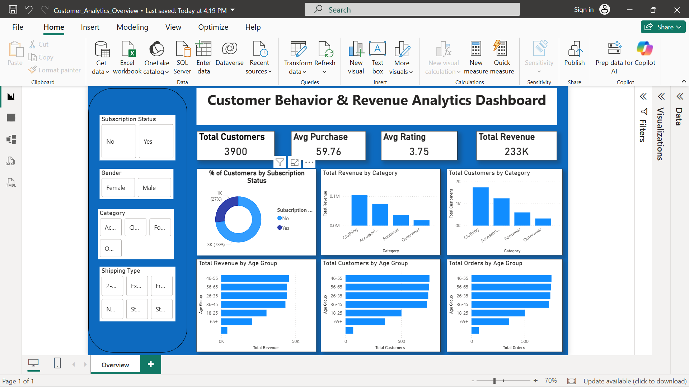

# 📊 Data Analyst Portfolio Dashboard


---

## 🚀 Project Overview

This project is a **complete Data Analytics solution** designed to analyze business data and generate actionable insights using **SQL, Python, and Power BI**.

It demonstrates a real-world **end-to-end BI workflow**:

- Data Collection 📥  
- Data Cleaning 🧹  
- Data Analysis 📊  
- Data Visualization 📈  
- Business Insights 💡  

---

## 👨‍💻 About Me

Hi, I’m **Abhishek Phatangare**, an aspiring **Data Analyst** passionate about transforming raw data into meaningful business insights.

### 🧠 Skills:
- Power BI Dashboard Development
- SQL (PostgreSQL)
- Python (Pandas, NumPy)
- Data Visualization
- Business Intelligence

---

## 🏆 Project Highlights

✔ End-to-end data analytics pipeline  
✔ Interactive Power BI dashboard  
✔ KPI tracking system  
✔ Customer behavior analysis  
✔ Sales & revenue insights  
✔ Data-driven decision making  

---

## 🛠️ Tools & Technologies

| Tool | Purpose |
|------|--------|
| Power BI | Data Visualization |
| SQL (PostgreSQL) | Data Extraction & Querying |
| Python | Data Cleaning & Analysis |
| Excel | Data Preparation |

---

## 📁 Project Structure
Data-Analytics-Portfolio/
│
├── data/ # Raw and cleaned datasets
├── powerbi/ # Power BI (.pbix file)
├── sql/ # SQL queries
├── python/ # Data processing scripts
├── screenshots/ # Dashboard images
└── README.md


---

## 📸 Dashboard Preview

<p align="center">
  
</p>

---

## 📊 Business Insights

✔ Identified top-performing products contributing highest revenue  
✔ Found customer segments with highest purchase frequency  
✔ Detected seasonal sales trends  
✔ Improved understanding of regional performance gaps  
✔ Highlighted opportunities for pricing & marketing optimization  

---

## 📈 Business Impact

This project helps organizations:

- 📌 Increase revenue through data insights  
- 📌 Optimize product pricing strategies  
- 📌 Improve customer targeting  
- 📌 Track KPIs in real-time  
- 📌 Support executive decision-making  

---

## 🧠 Key Learning Outcomes

- Real-world data pipeline design  
- Advanced Power BI dashboarding  
- SQL querying for analytics  
- Python-based preprocessing  
- Business storytelling with data  

---

## ⚙️ How to Run This Project

### 1️⃣ Clone Repository
```bash
git clone https://github.com/Abhishek-Phatangare/data-analytics-portfolio.git
---

## 📸 Dashboard Preview

<p align="center">
  
</p>

---

## 📊 Business Insights

✔ Identified top-performing products contributing highest revenue  
✔ Found customer segments with highest purchase frequency  
✔ Detected seasonal sales trends  
✔ Improved understanding of regional performance gaps  
✔ Highlighted opportunities for pricing & marketing optimization  

---

## 📈 Business Impact

This project helps organizations:

- 📌 Increase revenue through data insights  
- 📌 Optimize product pricing strategies  
- 📌 Improve customer targeting  
- 📌 Track KPIs in real-time  
- 📌 Support executive decision-making  

---

## 🧠 Key Learning Outcomes

- Real-world data pipeline design  
- Advanced Power BI dashboarding  
- SQL querying for analytics  
- Python-based preprocessing  
- Business storytelling with data  

---

## ⚙️ How to Run This Project

### 1️⃣ Clone Repository
```bash
git clone https://github.com/Abhishek-Phatangare/data-analytics-portfolio.git

2️⃣ Open Project
Open Power BI .pbix file
Load dataset if required
3️⃣ Explore
Analyze dashboards
Run SQL queries
Review Python scripts
📷 Dashboard Sections
🏠 Executive Overview
👥 Customer Analysis
📊 Sales Performance
📦 Product Insights
📈 Forecasting
📬 Contact

👤 Abhishek Phatangare
📧 Email: abhishekphatangare2004@gmail.com
🔗 LinkedIn: https://www.linkedin.com/in/abhishek-phatangare-147428367/
💻 GitHub: https://github.com/Abhishek-Phatangare

⭐ Support This Project

If you find this useful:

⭐ Star the repository
🍴 Fork it
🔗 Share with others
🧠 Final Note

This project represents my journey into Data Analytics, focusing on real-world business problem solving using data, logic, and visualization.
